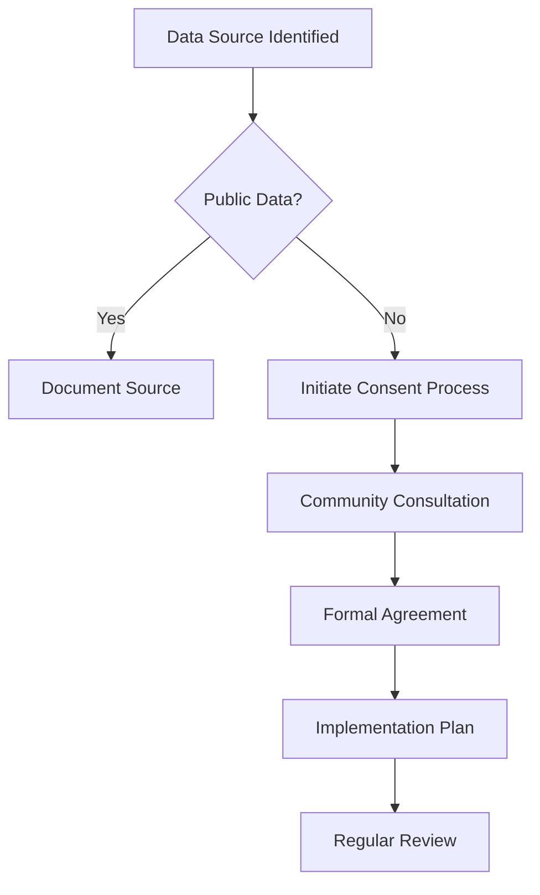
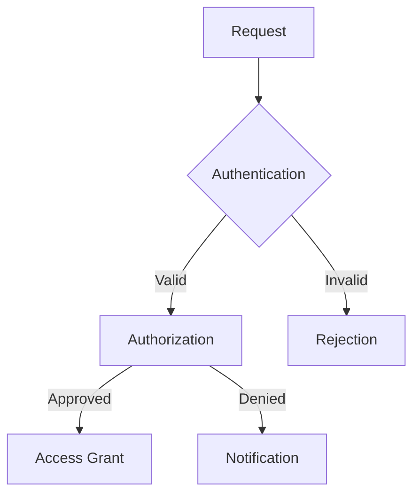

# NIMIK Data Sourcing and Aggregation

- What are our criteria for determining which MMIWG2S data sources to include?
- How will we prioritize and sequence the integration of different source types?
- What outreach and partnerships are needed to access relevant tribal and community MMIWG2S data?
- How will we handle MMIWG2S data sources with varying licenses, usage restrictions, or quality levels?
- What attribution and provenance information will we maintain for each MMIWG2S record?

## Additional Considerations 
- Identifying authoritative and credible MMIWG2S data sources, such as law enforcement databases, community-maintained lists, and existing MMIWG2S registries
- Assessing data quality, completeness, and timeliness of MMIWG2S sources to prioritize integration efforts
- Determining data integration requirements to merge MMIWG2S records from disparate sources into a unified database schema
- Establishing data sharing agreements with tribal, community, and government partners to access sensitive MMIWG2S case information
- Documenting data lineage and attribution details to respect the provenance and ownership of MMIWG2S data by originating communities
- Implementing data versioning to track updates and changes to MMIWG2S records over time as new information becomes available

## Potential Sources and Research Material
- Existing MMIWG2S databases, such as NamUs, NAMUS, and state/provincial missing persons registries 
- MMIWG2S data collection and reporting protocols developed by tribal and community organizations
- Data sharing agreement templates and MOUs specific to sensitive, community-owned data
- Data integration best practices and tools for merging missing persons records from multiple sources
- Metadata standards and provenance tracking approaches relevant to MMIWG2S data management 

## Data Sovereignty and Consent Framework

### Core Principles
1. **Indigenous Data Sovereignty**
   - [ ] Tribal ownership of data
   - [ ] Community-controlled access
   - [ ] Cultural knowledge protection
   - [ ] Traditional law integration
   - [ ] Collective benefit focus

2. **Informed Consent**
   - [ ] Clear consent processes
   - [ ] Revocable permissions
   - [ ] Granular control options
   - [ ] Cultural context respect
   - [ ] Community consultation

3. **Data Governance**
   - [ ] Tribal oversight
   - [ ] Community protocols
   - [ ] Ethical frameworks
   - [ ] Access controls
   - [ ] Usage monitoring

### Consent Workflows

#### Initial Data Collection

#### Data Usage Requests
1. **Request Reception**
   - [ ] Request documentation
   - [ ] Purpose verification
   - [ ] Impact assessment
   - [ ] Community notification

2. **Review Process**
   - [ ] Technical review
   - [ ] Cultural review
   - [ ] Community input
   - [ ] Risk assessment

3. **Decision and Implementation**
   - [ ] Formal response
   - [ ] Access provisioning
   - [ ] Usage monitoring
   - [ ] Regular review

### Data Sharing Agreements

#### Required Components
- [ ] Purpose and scope
- [ ] Usage limitations
- [ ] Access controls
- [ ] Security measures
- [ ] Review processes
- [ ] Termination conditions
- [ ] Dispute resolution
- [ ] Cultural protocols

#### Agreement Types
1. **Tribal Government**
   - Formal MOUs
   - Sovereign nation recognition
   - Traditional law integration
   - Joint governance protocols

2. **Community Organizations**
   - Partnership agreements
   - Shared responsibility models
   - Capacity building components
   - Resource sharing plans

3. **External Researchers**
   - Limited access agreements
   - Research protocols
   - Publication guidelines
   - Data return requirements

### Data Removal and Modification

#### Removal Requests
- [ ] Clear request process
- [ ] Quick response time
- [ ] Complete data purge
- [ ] Audit trail
- [ ] Community notification

#### Modification Protocol
- [ ] Change documentation
- [ ] Version control
- [ ] Update notification
- [ ] Impact assessment
- [ ] Community review

### Technical Implementation

#### Access Control System

#### Data Protection Measures
- [ ] Encryption standards
- [ ] Access logging
- [ ] Audit trails
- [ ] Backup protocols
- [ ] Emergency procedures

### Monitoring and Compliance

#### Regular Audits
- [ ] Access patterns
- [ ] Usage compliance
- [ ] Security measures
- [ ] Community feedback
- [ ] Impact assessment

#### Reporting Requirements
- [ ] Usage statistics
- [ ] Access requests
- [ ] Incident reports
- [ ] Community impact
- [ ] Improvement plans

> **Note**: All protocols are subject to regular review and updates based on community feedback and changing needs. 