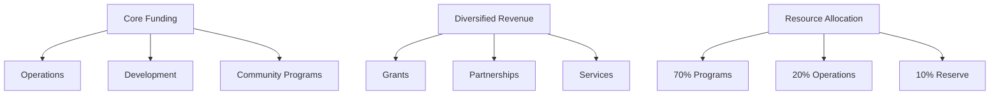
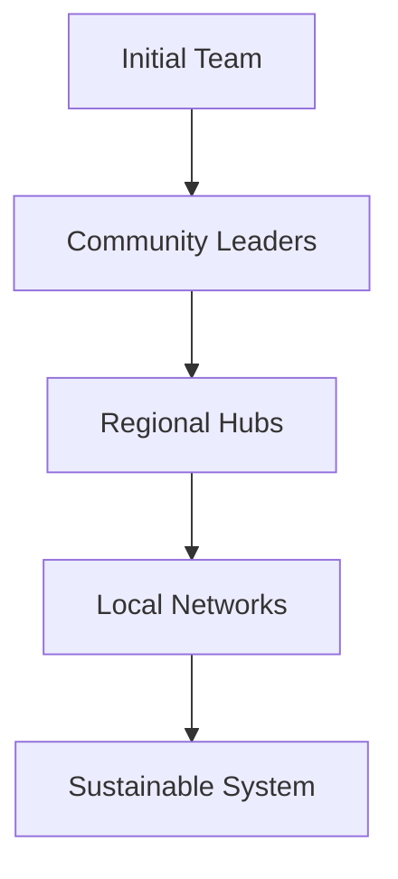

# NIMIK Impact and Storytelling

- What metrics will we track to assess platform usage, data quality, and MMIWG2S case outcomes?
- How will we share progress and findings back to contributing MMIWG2S communities?
- What storytelling and advocacy efforts will we pursue to drive awareness and action for MMIWG2S?
- How will we empower MMIWG2S families and communities to tell their own stories with the data?
- What partnerships could amplify the impact and reach of the platform for MMIWG2S?

## Additional Considerations
- Defining key performance indicators (KPIs) and success metrics
- Implementing data analytics and reporting capabilities
- Developing data visualization and storytelling templates
- Establishing regular community reporting and feedback loops
- Identifying impactful advocacy and awareness campaign opportunities
- Providing data storytelling training and resources for MMIWG2S families
- Partnering with media, advocacy, and research organizations to amplify impact
- Conducting impact evaluation and assessment studies

## Potential Sources and Research Material
- Impact measurement frameworks and metrics for data platforms
- Data analytics and reporting tools for tracking KPIs
- Data visualization and storytelling best practices and examples
- Community reporting and feedback mechanisms for data projects
- Advocacy and awareness campaign strategies and case studies
- Data storytelling training materials and curricula
- Impact evaluation methods and approaches for data platforms
- Potential partner organizations and collaboration models

## Sustainability and Capacity Building

### Long-Term Sustainability Strategy

#### Financial Sustainability

#### Funding Streams
1. **Core Support**
   - [ ] Foundation grants
   - [ ] Tribal partnerships
   - [ ] Government funding
   - [ ] Corporate sponsors
   - [ ] Individual donors

2. **Sustainable Services**
   - [ ] Training programs
   - [ ] Technical assistance
   - [ ] Research collaboration
   - [ ] Data services
   - [ ] Consulting support

3. **Resource Management**
   - [ ] Budget planning
   - [ ] Cost optimization
   - [ ] Reserve building
   - [ ] Asset management
   - [ ] Risk mitigation

### Community Capacity Building

#### Training Programs
1. **Technical Skills**
   - Data literacy
   - Platform usage
   - Digital security
   - Content creation
   - Analysis tools

2. **Advocacy Skills**
   - Story development
   - Media engagement
   - Public speaking
   - Campaign planning
   - Policy advocacy

3. **Leadership Development**
   - Project management
   - Community organizing
   - Grant writing
   - Strategic planning
   - Partnership building

#### Knowledge Transfer

##### Documentation
- [ ] User guides
- [ ] Training materials
- [ ] Best practices
- [ ] Case studies
- [ ] Templates

##### Mentorship
- [ ] Peer learning
- [ ] Expert guidance
- [ ] Skills sharing
- [ ] Leadership coaching
- [ ] Community support

### Transition Planning

#### Stewardship Model

#### Phases
1. **Foundation (Year 1)**
   - [ ] Core team building
   - [ ] Initial training
   - [ ] Basic systems
   - [ ] Key partnerships

2. **Expansion (Year 2)**
   - [ ] Regional networks
   - [ ] Advanced training
   - [ ] System enhancement
   - [ ] New partnerships

3. **Transition (Year 3+)**
   - [ ] Community leadership
   - [ ] Sustained funding
   - [ ] Full capabilities
   - [ ] Network strength

### Impact Measurement

#### Success Metrics
- [ ] Community engagement
- [ ] Data utilization
- [ ] Capacity growth
- [ ] System stability
- [ ] Resource sustainability

#### Evaluation Framework
1. **Quarterly Assessment**
   - Usage statistics
   - Community feedback
   - Resource status
   - Progress tracking
   - Need identification

2. **Annual Review**
   - Impact analysis
   - Strategy adjustment
   - Resource planning
   - Partnership evaluation
   - Growth planning

### Community Support Infrastructure

#### Resource Hub
- [ ] Online platform
- [ ] Training center
- [ ] Resource library
- [ ] Help desk
- [ ] Community forum

#### Support Network
- [ ] Regional coordinators
- [ ] Technical advisors
- [ ] Community mentors
- [ ] Partner organizations
- [ ] Expert consultants

### Continuous Improvement

#### Feedback Loops
- [ ] Regular surveys
- [ ] Community meetings
- [ ] User interviews
- [ ] Partner check-ins
- [ ] System analytics

#### Adaptation Process
1. **Gather Input**
   - Community needs
   - Usage patterns
   - Resource status
   - Impact data
   - External factors

2. **Analyze & Plan**
   - Gap analysis
   - Priority setting
   - Resource alignment
   - Action planning
   - Timeline development

3. **Implement & Review**
   - Phased rollout
   - Community validation
   - Progress monitoring
   - Impact assessment
   - Course correction

> **Note**: All strategies should be regularly reviewed and adjusted based on community feedback and changing needs.
